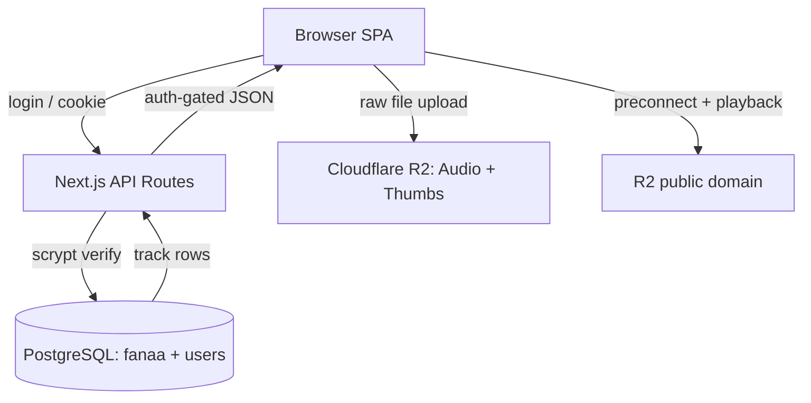

# JIGAR

> A minimal music streaming experience for discovery and uninterrupted listening.


---

## Why This Project Exists

Curating a personal music library across loose, overlapping collections is fiddly — playlists drift into strict structures and stale metadata. Interesting because a streaming app is built with no streaming server: static files on Cloudflare R2, Postgres as the only state, and an auth layer that trusts nothing cached.

## What It Does

- **Password-gated library** — one scrypt-checked login guards every view; failed attempts are throttled at 5 per IP per 15 min. `src/app/api/auth/login/route.ts:12`
- **Tag-driven playlists** — tracks carry comma-separated playlist tags, and the home grid collapses them into a live song-count per collection. `src/lib/db.ts:51`
- **Instant title/artist search** — results are debounced 250 ms and never cached, so they stay honest and live. `src/components/search-results.tsx:38`
- **One-click add-a-song** — pick MP3/thumbnail, upload to R2 (audio capped at 30 MB, images at 10 MB), then fill metadata. `src/app/api/upload/route.ts:9`
- **Uninterrupted playback** — the current track's successor is preloaded for instant switching; shuffle/repeat, keyboard shortcuts, and lock-screen Media Session included. `src/providers/player-provider.tsx:76`
- **Snappy revisits** — a 5-minute localStorage cache renders lists instantly while API responses stay `no-store`. `src/lib/cache.ts:4`

## Architecture



Opening the home page serves cached playlists from localStorage first, then fetches the auth-gated `/api/playlists` route, which derives tag counts from the `fanaa` table and returns them as JSON.

## Key Technical Decisions

### 1. Playlists As Tags (Schema)
**Problem:** Playlists that overlap need relational plumbing nobody wanted to operate.
**Solution:** One comma-separated `playlist` column; listing just splits and counts tags per row. `src/lib/db.ts:51`
**Outcome:** Creating a new playlist requires zero DDL — it exists the moment a track names it.

### 2. Sessions As Reverified Credentials (Security — treat client as hostile)
**Problem:** A bare session cookie is forgeable and easy to get wrong.
**Solution:** The cookie holds base64 `username:password`, and every protected route re-runs the scrypt check against `users`. `src/lib/session.ts:11`
**Outcome:** Stolen or forged cookies fail at the database; logout is instant, with no token store to revoke.

### 3. Cache-First, Then Network (Two-Tier State)
**Problem:** Re-fetching playlists on every revisit felt slow on weak links.
**Solution:** 5-min localStorage TTL served instantly, with stale-request aborts and auto-logout on 401. `src/lib/use-backend-data.ts:31`
**Outcome:** Home renders instantly on revisits while the server stays free of shared caching.

### 4. CSP Only In Production (Deploy Gotcha)
**Problem:** A strict CSP breaks Next dev's HMR scripting.
**Solution:** Headers apply only when `NODE_ENV === "production"`, and `https:` is allowed for img/media so R2 still loads if its env var is missing. `next.config.ts:56`
**Outcome:** Hardened headers in prod, working hot reload in dev, media never policy-blocked.

### 5. Version From Git Tags (Release Hygiene)
**Problem:** Hand-bumped version numbers drift from reality.
**Solution:** Prod builds `git fetch --tags`, take `git describe`, fall back to `package.json`. `next.config.ts:23`
**Outcome:** The header badge tracks the latest release tag with zero manual edits.

## Run Locally

Requires **Node ≥ 20.9** (Next 16.3 engine). Not zero-config — Postgres must already hold a `fanaa` tracks table (schema is not shipped; columns inferred from `src/lib/db.ts:25`).

```sh
cp .env.example .env   # fill DATABASE_URL, R2_*, NEXT_PUBLIC_R2_DOMAIN
npm install
npm run db:seed        # create `users` table + scrypt-hashed account
npm run dev            # http://localhost:3000
```

Production build: `npm run build` then `npm start`.

## Configuration

| Env var | Required | Effects when set |
| --- | --- | --- |
| `DATABASE_URL` | ✅ | Connect the pool to the fused Postgres (`fanaa` + `users`); unset → nothing runs. |
| `ALLOW_SELF_SIGNED_DB_SSL` | — | Skip TLS certificate verification for self-signed DB certs; unset → certs are verified. |
| `R2_ACCOUNT_ID` | — | Your R2 endpoint; needed with the next three for uploads. |
| `R2_ACCESS_KEY_ID` | — | R2 credential; unset → `/api/upload` errors clearly. `src/lib/r2.ts:30` |
| `R2_SECRET_ACCESS_KEY` | — | R2 credential (with `R2_ACCESS_KEY_ID`). |
| `R2_BUCKET_NAME` | — | Target bucket; files land under `Audio/` and `Thumbs/`. |
| `NEXT_PUBLIC_R2_DOMAIN` | — | Rewrites stored `r2.dev` URLs through your CDN domain and preconnects it; unset → raw `r2.dev` URLs. `src/lib/version.ts:15` |
| `JIGAR_USERNAME` / `JIGAR_PASSWORD` | — | Seed-only; upserts the auth user via `npm run db:seed` (prompts when unset). |

## Project Structure

```
src/app/
  page.tsx                  Home — playlist grid (client view)
  api/*                     Route handlers: auth, playlists, search, upload, add-song
src/lib/
  db.ts                     Postgres pool + fanaa/users queries
  r2.ts                     Cloudflare R2 upload client
  session.ts                Cookie session → scrypt re-verify
  cache.ts                  localStorage TTL cache
  use-backend-data.ts       Cache-first data-fetching hook
src/providers/player-provider.tsx   Audio element, transport, Media Session
src/components/             Shell, player bar, login, dialogs, views
scripts/seed-user.cjs       Creates `users` table, upserts scrypt user
next.config.ts              Security headers, prod-only CSP, git-tag version
```

---

<div align="left">
  <font face="Aref Ruqaa" size="5">فیروز خان چوہان</font>
</div>