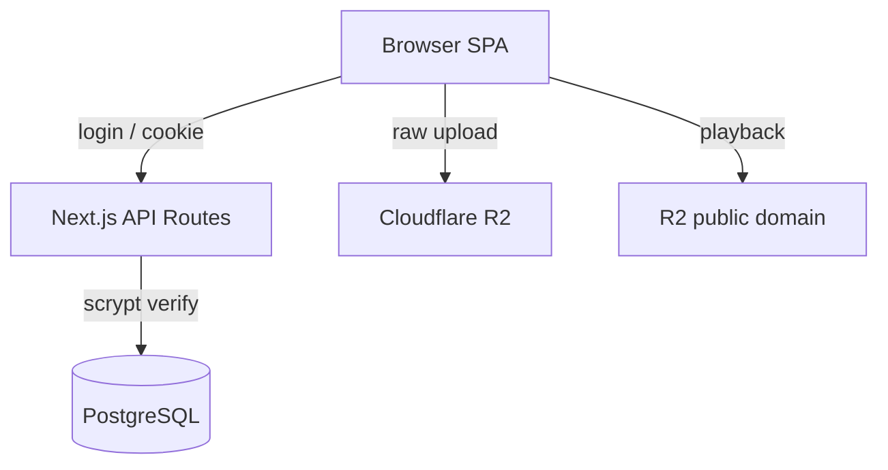

# Jigar

Minimal password-gated music streaming — static files on Cloudflare R2, Postgres as the only state, no streaming server.


## Install

```bash
git clone <repo-url> jigar && cd jigar
cp .env.example .env   # fill DATABASE_URL, R2_* (see below)
npm install
npm run db:seed        # creates users table + scrypt-hashed account
npm run dev            # http://localhost:3000
```

Requires Node ≥ 20.9 and a Postgres DB with a `fanaa` tracks table.

## Usage

Log in with your seeded credentials, then: browse tag-based playlists, search (debounced, live), add a song via one-click MP3 + thumbnail upload, play with shuffle/repeat, keyboard shortcuts, and lock-screen Media Session.

## Features

- One scrypt-checked login guards every view (5 attempts / IP / 15 min)
- Playlists are just comma-separated tags on tracks — zero DDL to create one
- Next track preloaded for instant switching
- 5-min localStorage cache renders lists instantly; API stays `no-store`

## Environment Variables

```bash
DATABASE_URL=            # required — Postgres pool (fanaa + users tables)
R2_ACCOUNT_ID=           # optional — all four needed for uploads
R2_ACCESS_KEY_ID=
R2_SECRET_ACCESS_KEY=
R2_BUCKET_NAME=
NEXT_PUBLIC_R2_DOMAIN=   # optional — CDN domain rewrite for media
```

## Architecture



Sessions are reverified credentials: the cookie holds base64 `user:password` and every route re-runs the scrypt check — forged cookies fail at the database, logout is instant.

## Development

```bash
npm run build && npm start   # prod (CSP headers apply in prod only)
npm run lint
npm run typecheck
```

## License

Private — all rights reserved.
